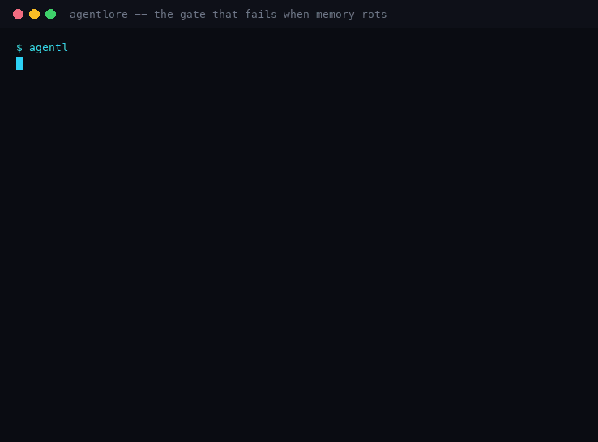

# agentlore

**Repo memory for coding agents — committed to your repository, reviewed in the pull request that
motivated it, and gated so it cannot silently rot.**

[](https://github.com/Rudra5417/agentlore/actions/workflows/tests.yml)
[](https://github.com/Rudra5417/agentlore/releases/latest)
[](https://pypi.org/project/agentlore/)
[](LICENSE)
[](.github/workflows/tests.yml)

Coding agents forget everything between sessions, and the facts worth keeping — decisions, dead
ends, house rules — end up in someone's head or in a chat log nobody will read again. `agentlore` gives
them somewhere to live: typed markdown in `.memory/`, versioned with the code, compiled into the
`AGENTS.md` your agent already reads, and **checked in CI**.

One file. Python standard library. No dependencies, no service, no account, nothing to configure.

Current release **v0.9.1** · [site](https://rudra5417.github.io/agentlore/) · [changelog](CHANGELOG.md) · [what it does not do yet](docs/gaps.md)



---

## The failure it exists for

An agent fixes a bug, and records the dead end it just disproved. The note is true when written and
false the moment the fix lands — and it now reads as a live warning to every future agent. Real
output, from one change:

```console
$ agentlore add --type dead-end \
    --title  "The refund window rejects credit notes too" \
    --body   "Routing credit notes through refund() fails: the vendor rejects them." \
    --anchor "src/billing/**" --evidence "PR #4821 - double charge"

$ agentlore check --since "$BASE_SHA"        # in CI: github.event.pull_request.base.sha
MEMORY-HEALTH: 17/18 BROKEN  (1 memories, 0 stale, billing)
  ...
  FAIL dead-ends-settled  -- 1 unsettled

dead ends that rode the change that settled them:
  DEAD-2026-09-29-95f7  The refund window rejects credit notes too
    anchored to src/billing/**, changed in this same change: src/billing/gateway.py
    -> this memory now reads as a live warning about a condition your change removed.
    -> state it: agentlore verify DEAD-2026-09-29-95f7 --resolved-by "<what settled it>"
    -> or retype it as a decision and write the title about the CURRENT rule.

2 finding(s) -> fix before merging
```

The agent's body hedged ("before the fix"); the **heading** did not — and the heading is the first
thing the next agent reads. So the tool rewrites it rather than trusting the agent to:

```console
$ agentlore verify DEAD-2026-09-29-95f7 --resolved-by "vendor supports credit notes as of v3.2"
verified DEAD-2026-09-29-95f7 @ b5c646d

$ grep '^## ' .memory/dead-ends.md
## The refund window rejects credit notes too (settled)

$ agentlore check --brief
MEMORY-HEALTH: 17/18 BROKEN -- compile-current     # the file your agent reads is now stale
$ agentlore compile
$ agentlore check --brief
MEMORY-HEALTH: 18/18 GREEN
```

Three states, three honest outputs: the memory stopped being true, the record was corrected, and
then the *compiled* file your agent actually loads was caught lagging behind it. That last one is a
check most tools do not have — memory that is recorded but never delivered is invisible in every
direction. [The accuracy gate, in full →](docs/design.md#the-accuracy-gate)

## Install

One 89 KB Python file with no dependencies, so there is nothing to install in the package-manager
sense — you pick how much of it you want to own.

**Requirements:** Python **3.9+** (CI runs 3.9 and 3.12) and `git`. That is the whole list: no
virtualenv, no lockfile, no build step. There is nothing to resolve, pin or audit — the tool is a
single stdlib file. The canonical artifact is that one file; a package-index install is a managed
copy of it, not a different thing.

### 1. As a GitHub Action — nothing to install

Usually the right answer, because the gate is the part that has to run on every PR:

```yaml
      - uses: actions/checkout@v4
        with:
          fetch-depth: 0        # only so an annotation can name the file that drifted
      - uses: Rudra5417/agentlore@v1
        with:
          since: ${{ github.event.pull_request.base.sha }}
```

GitHub fetches the tool for you. Nothing in your repo changes, and there is no version to track —
`@v1` is a moving tag, so you get fixes without editing workflows.

### 2. Vendored into your repo — self-contained, no third-party action

The opposite trade: you own the file, so CI needs no network fetch and no action dependency. Some
organisations require this.

```bash
mkdir -p tools
curl -fsSL -o tools/agentlore https://raw.githubusercontent.com/Rudra5417/agentlore/v0.9.1/agentlore
chmod +x tools/agentlore
git add tools/agentlore
python3 tools/agentlore check --brief          # runs with no install at all
```

Pin the tag (as above) for reproducibility, or use `main` to track HEAD. Then wire it into a job the
same way the action does it — see [docs/using.md](docs/using.md#ci-the-review-gate) for the three
commands.

### 3. On your PATH — for local use, and for an agent to call

Worth it if you want an agent to run `agentlore` itself, or to check memories before pushing:

```bash
mkdir -p ~/.local/bin
curl -fsSL -o ~/.local/bin/agentlore https://raw.githubusercontent.com/Rudra5417/agentlore/v0.9.1/agentlore
chmod +x ~/.local/bin/agentlore
agentlore --version                            # agentlore 0.9.1
```

If `~/.local/bin` is not already on your `PATH`, add it (`export PATH="$HOME/.local/bin:$PATH"`).
Prefer `git clone`? The tool is just the file at the repo root — copy it wherever you like; nothing
depends on its location, and it runs from any working directory.

### 4. From a package index — `pip`, `pipx` or `uv`

A managed copy of the same file, for when you would rather not vendor or curl it:

```bash
uv tool install agentlore        # or: pipx install agentlore   /   pip install agentlore
agentlore --version              # agentlore 0.9.1
```

The package ships the identical single, zero-dependency file — installing it resolves nothing.

### Check it before you wire it in

```console
$ agentlore init && agentlore check --brief
MEMORY-HEALTH: 18/18 GREEN
```

An empty `.memory/` is green on purpose: there is nothing to be wrong about yet.

## Quick start

```bash
agentlore init          # 1. create .memory/, gitignore the derived index
                   # 2. your agent (or you) records what it learns:
agentlore add --type decision \
    --title "Refunds close at 90 days" --body "Vendor contract; enforced in gateway.py." \
    --anchor 'src/billing/**' --evidence "PR #4821"
agentlore compile       # 3. deliver it — writes a block into AGENTS.md
agentlore check         #    exit 1 when a memory has stopped being true
```

(Using the vendored copy from option 2? Every command below is `python3 tools/agentlore …` instead.)

Commit the `.memory/*.md` and the `AGENTS.md` block. That is the whole model: the markdown is the
source of truth, the index is derived, and the memory **rides the pull request** that motivated it,
where a teammate reviews it like code.

Then add the gate. No vendored copy, nothing to keep in sync:

```yaml
      - uses: actions/checkout@v4
        with:
          fetch-depth: 0        # only so an annotation can name the file that drifted
      - uses: Rudra5417/agentlore@v1
        with:
          since: ${{ github.event.pull_request.base.sha }}
```

`since` is the one input worth setting: without it `dead-ends-settled` cannot tell what your change
touched, and a silent check is a disabled check.
[Action inputs and the CI wiring →](docs/using.md#ci-the-review-gate)

## What the gate catches

Eighteen checks. A failure names the broken thing and the fix, and prints on the line of the memory
that is wrong.

| check | catches |
|---|---|
| `index-present` / `index-fresh` | `.memory/` with no index, or markdown edited in review without a rebuild |
| `ids-present` / `ids-unique` | malformed or duplicated entries |
| `anchors-resolve` | a memory anchored to code that is gone |
| **`anchors-stamped`** | **a memory with no fingerprint — drift would be undetectable** |
| **`anchors-not-stale`** | **the anchored content changed and the memory did not** |
| **`dead-ends-settled`** | **a dead end recorded by the very change that settled it** |
| `dead-ends-evidenced` | a "we tried this" with no proof — i.e. superstition |
| `reviews-current` | a `review_by` date that has passed |
| `supersedes-resolve` / `supersedes-acyclic` | a retirement chain that points nowhere, loops, or lands on a retired memory |
| **`hazards-enforced`** | **a "do not touch" that no control actually enforces** |
| **`claims-agree`** | **two live memories claiming different things about the same key** |
| **`compile-current`** | **`AGENTS.md` is not what `compile` would produce — recorded but never delivered** |
| **`no-secrets`** / **`no-pii`** | **a key, token or private key; a payment card, SSN, or bulk list of personal addresses** |
| **`no-agent-directives`** | **a memory telling the agent to conceal something, skip the gate, handle credentials, or weaken a control** |

One softer signal is reported but never breaks the build: a **notice** when anchored files were only
reformatted — bytes changed, meaning identical.
[All eighteen, in detail →](docs/design.md#memory-health)

## Honest status

The part most tools do not have. The memory *mechanism* is proven; the memory's *benefit* is not.
Nothing here asks you to believe a claim that is not on this table.

| claim | status | evidence |
|---|---|---|
| memory can be recorded, anchored and versioned in the repo | **proven** | 115 tests; the shipped example |
| staleness is detected by **content**, not git history | **proven** | a fixture whose memory root is a subdirectory; the `--relative` fix |
| the gate **blocks a PR** that rides its own dead end | **proven** | a real check run on PR #1: two annotations, then `success` once the same PR resolved it |
| an ambiguous id, an unresolvable `--since`, or a check that cannot run at all, **fails closed or is not counted** | **proven** | `TestFailClosed`, `TestSinceBoundary`: a check with no boundary and a clean tree is excluded from the score, never reported as a pass |
| decided contradictions are caught | **proven, narrowly** | shared claim key + divergent value only; prose-vs-prose is deliberately out of scope |
| every host reads the compiled memory | **mixed** | [INTEGRATION.md](INTEGRATION.md): most do; Gemini CLI needs config; all have truncation caps that silently drop the tail |
| **memory makes an agent do better work** | **preliminary** | [bench/](bench/README.md): trap rate 4-in-7 → 2-in-22, Fisher p = 0.018 — but the control arm is only n=7 (the gateway ran out of credit mid-run), so this is "pending a full control arm", not a result. An earlier fixture returned a real null. |
| works in a monorepo | **unproven** | no per-package scoping; the `--relative` bug proved silent failure in subfolders |
| safe against a poisoned memory | **no** | `.memory/` is privileged input to a machine with credentials; no signing, no tamper-evidence |

`unproven` means the experiment has not been run, or it came back null — not that the result was
inconvenient. `preliminary` means it ran and points somewhere, but the sample is too small to
claim. [The full table, the agent trials, and how they were measured →](docs/evidence.md)

## How it differs

- **`AGENTS.md` / `CLAUDE.md`** — plain prose, hand-written, loaded in full every session, and it
  rots silently. `agentlore compile` feeds it: typed fragments are the source, `AGENTS.md` is a build
  target, so nothing has to change its read path.
- **mem0 / claude-mem / OpenMemory** — auto-capture into an opaque store. Not reviewable, not shared
  ground truth, not versioned with the code.
- **ADRs** — reviewable and versioned, but too much ceremony per decision and no agent write path.
  Nothing in an ADR tells you it has stopped being true.
- **fiberplane/drift** (the most-adopted tool here, ~146★) — AST-symbol anchoring, which is better at
  decay than a content hash, but it watches *docs*, with no typed decisions, no supersession and no
  accuracy check.
- **gitmem, stalebrain, agent-memory, sverklo, lore** — each owns a piece. Nobody composes it into one
  loop that also refuses to hand over memory it suspects is wrong, and nobody binds a memory to the
  control that enforces it.

The unclaimed property is **accuracy**: every tool in this space checks whether memory is *stale*.
None checks whether it is *true*.
[Prior art and the evidence behind that line →](docs/contradictions.md)

## Docs

| | |
|---|---|
| **[INTEGRATION.md](INTEGRATION.md)** | **Start here to adopt it.** Which hosts read `AGENTS.md` and which need config, what shadows it, the truncation caps that drop the tail, and the probe that proves the memory arrived. |
| [docs/design.md](docs/design.md) | The three rules, all eighteen checks, the accuracy gate. |
| [docs/using.md](docs/using.md) | Full command reference, the memory lifecycle, CI wiring. |
| [docs/contradictions.md](docs/contradictions.md) | What can be decided, what must never be guessed, and why. |
| [docs/hazards.md](docs/hazards.md) | "Don't touch billing" — a pointer to a control, not a control. |
| [docs/secrets.md](docs/secrets.md) | Why a memory is a worse place for a secret than ordinary source. |
| [docs/evidence.md](docs/evidence.md) | The honest table, the agent trials, and the test suite. |
| [docs/gaps.md](docs/gaps.md) | What is not built, stated plainly, plus enterprise notes. |
| [bench/](bench/README.md) | The efficacy harness, the method, and the null. Re-run it against your repo. |

```bash
python3 run_tests.py       # 115 tests, ~40s, stdlib only — same as the tool
```

CI runs the suite on Python 3.9 and 3.12, then puts the shipped example through its own memory gate
on every pull request using the published tag.

## Contributing

The most valuable thing you can send is **a case where it does the wrong thing** — a false failure, a
missed staleness, a gate that went green when it should have gone red. See
[CONTRIBUTING.md](CONTRIBUTING.md). Security issues: [SECURITY.md](SECURITY.md), privately.

MIT — [LICENSE](LICENSE). Release history: [CHANGELOG.md](CHANGELOG.md).
